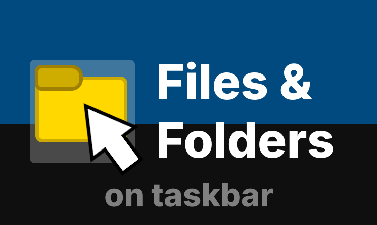
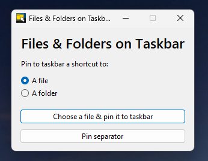
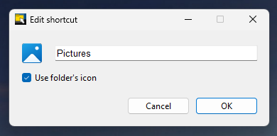
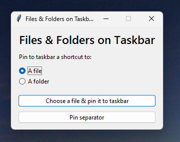

<div align="center">
    
</div>

# Files & Folders on Taskbar
A simple tool for pinning files and folders to the taskbar. It looks like this:



This tool can create a shortcut to a file or folder that can be pinned to your taskbar. 

It can also create a separator shortcut for further organising the shortcuts on your taskbar.

## ℹ️ How it works?
Before creating the shortcut, you'll be asked to pick the file/folder you want to pin to the taskbar. 

After choosing the file or folder, a dialog asking you to customize the shortcut will appear. It looks like this:



This dialog will allow you to change the name of the shortcut and its icon. If you uncheck "Use folder's icon", you will be able to choose a custom icon for the folder's shortcut. You can also choose a custom icon for a file's shortcut.

After customizing the shortcut, a File Explorer window will open with the folder where the shortcut has been saved. Now you'll need to drag the shortcut to your taskbar. I will have to find a way to pin the shortcut directly to the taskbar, but right now it seems complicated...

## 🎨 Separator styles
This app supports the following separator styles:

| Style | Info |
|:------|:-----|
| Vertical | A vertical line. Suitable for horizontal taskbars.
| Horizontal | A horizontal line. Suitable for vertical taskbars.
| Transparent | A completly transparent image.

When creating a separator shortcut, you will be asked about its style in this window:



## ▶️ Running from source
Before running from the source, you must install the dependencies. To do that, open Command Prompt in the folder of the cloned repository and run the following command:

```
pip install -r requirements.txt
```

After that, open the `main.py` file.

## 🏗️ Building

### Building the app
Just run `build_app.bat`. It will do everything needed to build the app. After the build process is done, you can find the built app in a `build` folder (or in a `dist` folder if the renaming process fails).

### Building the installer
Before building the installer, you must install Inno Setup Compiler on your computer. You can download it [here](https://jrsoftware.org/isdl.php/).

Also, you must build the app first before building the installer. After building the app, make sure a `build` folder appears. If it doesn't and appears a `dist` folder intstead, rename that folder to `build`. After that, right-click `build_installer.iss` and choose `Compile with Inno Setup`. After the installer was built, you can find it in the same `build` folder.

## 💿 Download
Comming soon...